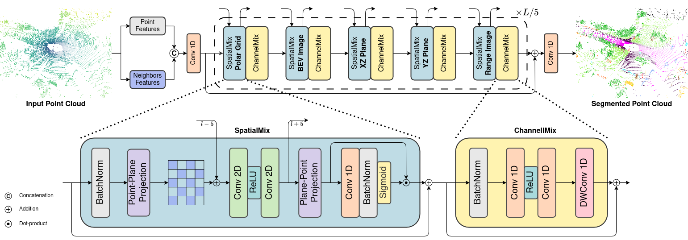

# 3PNet

**Point-Plane Projections for Accurate LiDAR Semantic Segmentation in Small Data Scenarios**



## Installation/Requirements

Code tested with Python 3.10 and the main packages: 

- pytorch 2.1.2 + CUDA 11.8
- torchvision 0.16.2
- numpy 1.24.4
- opencv
- tensorboard
- fvcore
- timm
- scipy
- tqdm

To install and use the CUDA KD-Tree, please refer to the instructions in the [WaffleAndRange](https://github.com/Bender97/WaffleAndRange) repo.

Code has also been tested successfully with torch 2.4.1 and cuda 12.4.

## Data Preparation

### SemanticKITTI

Download SemanticKITTI dataset from the [official website](https://semantic-kitti.org/).

### PandaSet

Download PandaSet dataset from the [official website](https://pandaset.org/) and raw Pandar64 LiDAR data from the link provided in this [Github Issue](https://github.com/scaleapi/pandaset-devkit/issues/67#issuecomment-674403708).

Follow the instructions on this [repo](https://github.com/SiMoM0/Pandaset2Kitti) to convert the PandaSet dataset to the SemanticKITTI format.

## Training

To train, run the following command, specifying as **dataset_name** one among ```semantic_kitti```, ```semantic_kitti_sdata``` and ```pandaset```, for both the dataset and config file:

```
python3 launch_train.py --dataset dataset_name --path_dataset path/to/dataset --config ./configs/3PNet-dataset_name.yaml --log_path path/to/logs
```

For instance, to train on SemanticKITTI standard setup, use:

```
python3 launch_train.py --dataset semantic_kitti --path_dataset /semanticKITTI/dataset/ --config ./configs/3PNet-semantickitti.yaml --log_path ./logs/skitti
```

To run on multi-GPU, specify the argument ```--multiprocessing-distributed``` while to train the network on both the val and train sets, use ```--trainval```.

For PandaSet small-data setup, change the data configuration yaml file inside the **pandaset.py** file.

## Testing

To evaluate on SemanticKITTI validation set and both PandaSet validation and test sets, run the following command, specifying the select dataset in **dataset_name** and the model checkpoint:

```
python3 evaluation.py --config ./configs/3PNet-dataset_name.yaml --dataset dataset_name --path_dataset path/to/dataset --ckpt path/to/model.pth --result_folder path/to/predictions/ --phase <val, test> [--save]
```

For instance, to evaluate on PandaSet (and save predictions with the ```--save``` argument), use:

```
python3 evaluation.py --config ./configs/3PNet-pandaset.yaml --dataset pandaset --path_dataset /PandaSet/dataset/ --ckpt ./logs/pandaset/ckpt_best.pth --result_folder ./preds_pandaset --phase test --save
```

For submission to the official benchmark on the test set of SemanticKITTI, use the following command, specifying ```--num_votes``` as number of test time augmentations (TTA):

```
python3 eval_kitti.py --config ./configs/3PNet-semantickitti.yaml --path_dataset /semanticKITTI/dataset/ --ckpt ./logs/skitti/ckpt_best.pth --result_folder ./predictions/ --phase test --num_votes 12
```

## Models

Pre-trained model can be downloaded from [Drive](https://drive.google.com/drive/folders/1sNPkmXbRt0BaaEXORyGeVojrntqoXQgl?usp=sharing).

| Model                    | Dataset   | Setup               | Val  | Test |
|--------------------------|-----------|---------------------|------|------|
| kitti_smalldata_base     | KITTI     | Small Data          | 26.8 |      |
| kitti_smalldata_cutmix   | KITTI     | Small Data + CutMix | 27.8 |      |
| kitti_fulldata           | KITTI     | Full Data           |      | 70.9 |
| pandaset_smalldata       | PandaSet  | Small Data          | 34.6 | 36.9 |
| pandaset_fulldata        | PandaSet  | Full Data           |      | 65.2 |

## Reference

Paper submitted to CVIU.

## License

This project is based on [WaffleIron](https://github.com/valeoai/WaffleIron) and [WaffleAndRange](https://github.com/Bender97/WaffleAndRange), which are licensed under the [Apache License 2.0](https://github.com/SiMoM0/3PNet/blob/master/LICENSE). 

3PNet is released under the [Apache License 2.0](https://github.com/SiMoM0/3PNet/blob/master/LICENSE). Changes have been made by authors of the paper.


## Acknowledgements

The code is based on [WaffleIron](https://github.com/valeoai/WaffleIron) and [WaffleAndRange](https://github.com/Bender97/WaffleAndRange) repositories.